# Pt1.5: Docker + MongoDB

## Descripció breu del projecte
Aquest projecte tècnic consisteix en el disseny, desplegament i optimització d'una base de dades NoSQL utilitzant MongoDB i Docker.

L'objectiu principal és orquestrar l'entorn de desenvolupament mitjançant Docker Compose, assegurant la persistència de la informació a través de la configuració de volums. Sobre aquesta infraestructura, es desenvolupa i documenta de forma professional un sistema complet d'operacions CRUD i consultes avançades (aplicant filtres, projeccions i operadors complexos), així com la creació i gestió d'índexs per a l'optimització del rendiment de la base de dades.

## Bloc 0 – Preparació de l’entorn i documentació

1. Crea el projecte al SCV al núvol. Comença a actualitzar el fitxer README.md amb el títol i descripció breu del projecte. <br>
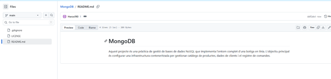
<br>
2. Crea un fitxer anomenat practica.md per respondre a les preguntes i penjar les captures de pantalla d’aquest enunciat.<br>
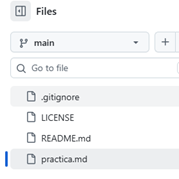
<br>
3.	Instal·la git en local, si no el tens. Verifica la versió amb: git --version<br>
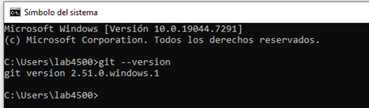
<br>
4.	Clona el repositori en remot al teu local. A partir d’aquí pots treballar en el teu repositori local. Pots utilitzar un IDE com VS Code per editar els fitxers Markdown.<br>
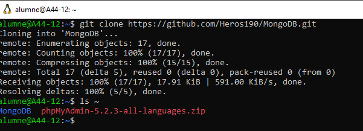
<br>
5.	Ves fent commits sovint per tenir el repositori al núvol sincronitzat amb el teu local.<br>
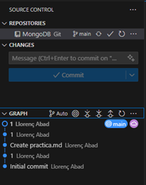
<br>
**Seguim amb Docker:**
Cal que tinguis instal·lat en el teu entorn de treball docker. Un cop instal·lat, executa les comandes següents al terminal i comprova que no retornen errors:<br>
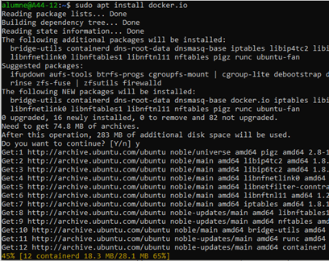
<br>
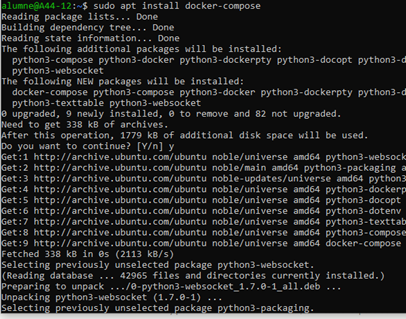
<br>

docker --version<br>
docker compose version <br>
docker run hello-world<br>

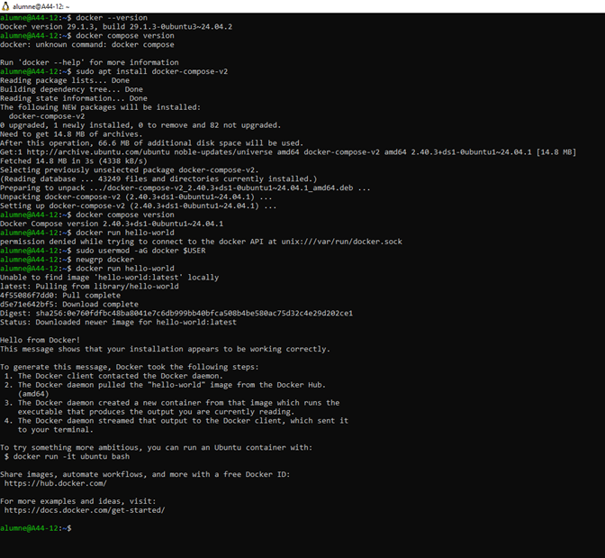
<br>
Crea la següent estructura de projecte. Crea la carpeta del projecte i l'estructura de fitxers tal com s'indica. Pots fer-ho manualment o amb les comandes del terminal.<br>
practica-mongodb/
├── docker-compose.yml       # Definició dels serveis<br>
├── mongo-init/<br>
│   └── init.js              # Script d'inicialització<br>
├── queries/<br>
│   ├── crud.js              # Operacions CRUD<br>
│   └── advanced.js          # Consultes avançades<br>
├── data/                    # Volum de dades (auto-generat)<br>
└── README.md                # Documentació del projecte<br>
<br>
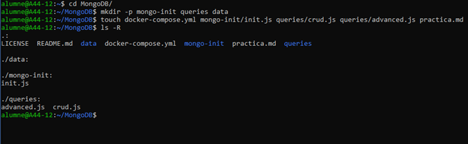<br>

## Bloc 1 – Configuració Docker Compose<br>

Crea el fitxer docker-compose.yml a l'arrel del projecte. Aquest fitxer definirà dos serveis: el servidor MongoDB i el client Mongo Express per gestionar la base de dades des del navegador.<br>

### 1.1 Servei MongoDB<br>
El servei de MongoDB ha de complir els requisits següents:<br>
●	Imatge: mongo:7.0<br>
●	Nom del contenidor: mongodb-botiga<br>
●	Port exposat: 27017 (host) → 27017 (contenidor)<br>
●	Variables	d'entorn:	MONGO_INITDB_ROOT_USERNAME	i MONGO_INITDB_ROOT_PASSWORD<br>
●	Volum: muntar ./data a /data/db per a la persistència<br>
●	Volum: muntar ./mongo-init a /docker-entrypoint-initdb.d per a la inicialització<br>
●	Xarxa: xarxa personalitzada (amb nom) anomenada xarxa-botiga<br>
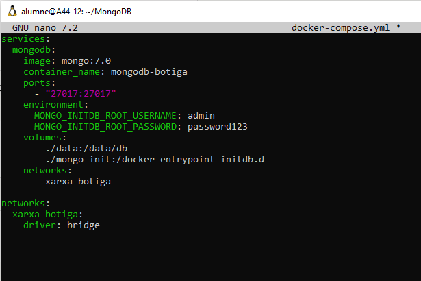<br>

### 1.2	Servei Mongo Express<br>
Mongo Express és una interfície web per gestionar MongoDB. Ha de complir:<br>
●	Imatge: mongo-express:1.0<br>
●	Nom del contenidor: mongoexpress-botiga<br>
●	Port exposat: 8081 (host) → 8081 (contenidor)<br>
●	Dependència: ha d'arrancar després de mongodb-boti<br>
●	Variables	d'entorn	per	connectar	amb	MongoDB: ME_CONFIG_MONGODB_ADMINUSERNAME, ME_CONFIG_MONGODB_ADMINPASSWORD, ME_CONFIG_MONGODB_URL<br>
●	Reinici automàtic: restart: unless-stopped<br>
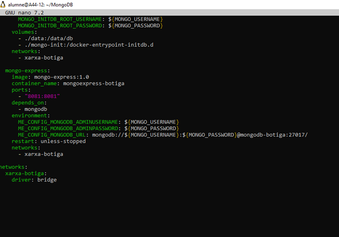<br>
⚠ No s’han de posar mai contrasenyes en clar en fitxers que pugin a repositoris públics.
En un entorn productiu s'utilitzen Docker Secrets o fitxers .env (afegit al .gitignore).<br>
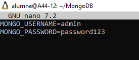<br>

### 1.3 Preguntes teòriques<br>
#### 1. Quina és la diferència entre docker run i docker compose up?

**docker run** serveix per arrancar un únic contenidor de forma manual, 
especificant totes les opcions per línia de comandes. 
**docker compose up** llegeix el fitxer `docker-compose.yml` i arranca 
tots els serveis definits de cop, amb tota la configuració ja guardada 


#### 2. Per a què serveix depends_on? Garanteix que el servei dependent estigui completament operatiu?

**depends_on** indica l'ordre d'arrencada dels serveis. En el nostre cas, 
Mongo Express no arrancarà fins que el contenidor de MongoDB hagi arrancat.
Però **no garanteix** que MongoDB estigui completament operatiu i llest 
per acceptar connexions, només que el contenidor ha estat iniciat. 
Per això Mongo Express té **restart: unless-stopped**, per reiniciar-se 
automàticament si no pot connectar amb MongoDB.

#### 3. Explica quina és la diferència entre una xarxa bridge per defecte i una xarxa personalitzada (amb nom) a Docker Compose.

- **Bridge per defecte:** Docker assigna automàticament una xarxa als 
contenidors, però aquests no es poden comunicar entre ells pel nom del 
contenidor, cal usar la IP.

- **Xarxa personalitzada (amb nom):** La creem nosaltres al 
`docker-compose.yml` (com `xarxa-botiga`). Els contenidors es poden 
comunicar entre ells usant el nom del contenidor com a hostname. 
Per exemple, Mongo Express pot connectar amb MongoDB usant 
`mongodb-botiga:27017` en lloc d'una IP.


## Bloc 2 – Model de dades, volums i persistència de dades<br>
### 2.1	Script d'inicialització<br>
Crea el fitxer mongo-init/init.js. Aquest script s'executarà automàticament quan el contenidor s'engegui per primera vegada. Ha de crear la base de dades botiga i les següents col·leccions:<br>
-	productes amb, com a mínim, 10 documents amb l'estructura següent:<br>
{<br>
nom: String,	            // Nom del producte<br>
preu: Number,	            // Preu en euros (decimal)<br>
categoria: String,	        // 'electrònica', 'roba', 'llar', 'esport'... <br>
estoc: Number,	            // Unitats disponibles<br>
valoracio: Number,	        // De 1.0 a 5.0<br>
actiu: Boolean,	            // Si el producte està disponible per a vendre etiquetes: [String], // Array d'etiquetes<br>
creat_el: Date	            // Data de creació<br>
}<br>

- clients:<br>
    -	Defineix les dades mínimes que necessites del client i modelitza la col·lecció.<br>
    -	Crea com a mínim 10 clients.<br>
-	comandes:<br>
    -	Defineix les dades mínimes que necessites d’una comanda i modelitza la col·lecció.<br>
    -	Crea com a mínim 10 comandes.<br>

### 2.2	Prova de persistència<br>
Demostra que els volums funcionen correctament seguint aquests passos i documenta cada pas amb una captura de pantalla:<br>

1.	Engega l'entorn: docker compose up -d<br>
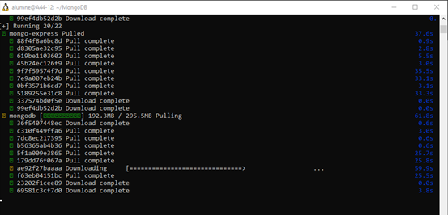<br>
2.	Accedeix a Mongo Express (http://localhost:8081) i verifica que existeix la BD botiga<br>
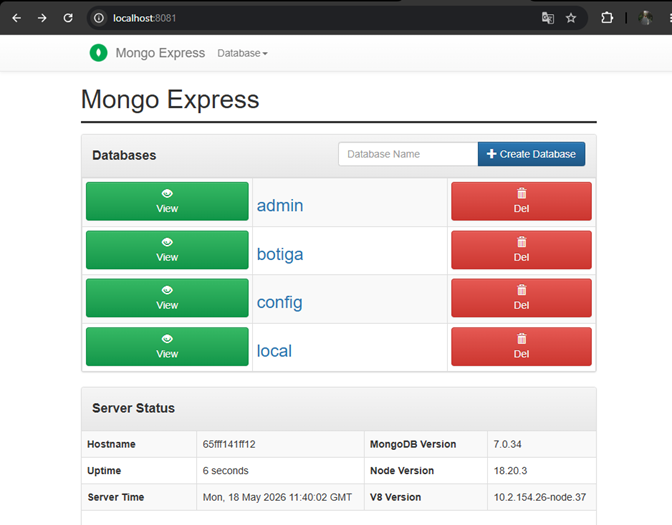<br>
3.	Atura i elimina els contenidors: docker compose down<br>
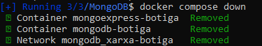<br>
4.	Torna a engegar: docker compose up -d<br>
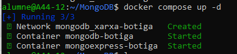<br>
5.	Verifica que les dades encara existeixen<br>
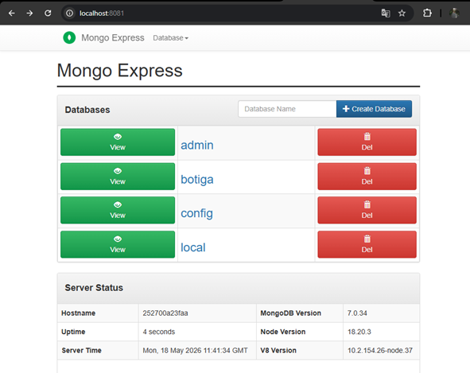<br>

### 2.3 Preguntes teòriques<br>
#### 1.	Què passaria si no definíssim cap volum al docker-compose.yml? Fes la prova i documenta el resultat.

Si no es defineix cap volum al fitxer `docker-compose.yml`, MongoDB utilitzarà l'emmagatzematge intern del mateix contenidor. Les dades són totalment **volàtils**.

Al fer la prova eliminant les línies de volumes i fent un **docker compose down** seguit d'un **docker compose up -d**, el resultat és que quan es destrueix el contenidor, totes les dades guardades s'esborren definitivament. 


#### 2.	Explica la diferència entre un volum named (amb nom) i un bind mount (ruta del host). Quan convé usar cada un?

**Diferència:**
- **Bind Mount (Ruta del host):** Enllaça una carpeta concreta del teu ordinador (en el meu cas `./mongo-init`) amb una carpeta interna del contenidor. 
Tu tens el control total dels fitxers des del teu explorador de fitxers o editor de codi.

- **Named Volume (Volum amb nom):** És un espai d'emmagatzematge gestionat completament per Docker (es guarda en rutes internes de Docker com `/var/lib/docker/volumes/...`). L'usuari no sol accedir directament a aquests fitxers des del sistema operatiu host.

**Quan convé usar cada un:**
- **Convé usar Bind Mount** durant la fase de **desenvolupament**. Va perfecte per provar el teu codi o l'arxiu `init.js` i veure de seguida si funciona o té errors sense haver de reiniciar res.

- **Convé usar Named Volume** En **producció**. S'usa per guardar les dades importants, en el meu cas, les dades reals de la base de dades `(/data/db)`, perquè no es perdin mai i vagin a màxima velocitat.


#### 3.	Explica la diferència entre l’estratègia embedding i l’estratègia referència amb exemples. Cal que els exemples siguin diferents dels que s’exposen en aquest document.

- **Estratègia Embedding (Incrustació):** Consisteix a guardar informació relacionada dins del mateix document principal com un objecte incrustat.
  - *Exemple:* Una aplicació de xarxes socials. Tenim la col·lecció usuaris i, en lloc de crear una taula a part per a les preferències de la interfície, cada document conté un objecte ajustes amb camps com idioma i mode_fosc. Aquesta informació pertany exclusivament a aquell usuari, no es comparteix amb ningú més i és idònia per recuperar-la de cop en iniciar la sessió.
```json
{
  "_id": "usuari_01",
  "nom": "Marta",
  "email": "marta@email.com",
  "ajustes": {
    "idioma": "Català",
    "mode_fosc": true
  }
}
```

- **Estratègia Referència:** Consisteix a mantenir els documents en col·leccions separades i enllaçar-los guardant l'identificador (`_id`) d'un document dins de l'altre (com una clau forana).
  - *Exemple:* Una aplicació d'escola de música. Tenim la col·lecció `professors` i la col·lecció `alumnes`. En lloc de ficar tots els alumnes dins del professor (ja que un professor pot tenir centenars d'alumnes al llarg dels anys i el document creixeria massa), guardem un camp `professor_id` dins de cada document d'alumne per fer-hi referència.
```json
// Col·lecció: professors
{
  "_id": 3,
  "nom": "Carlos",
  "instrument": "Piano"
}

// Col·lecció: alumnes
{
  "_id": 101,
  "nom": "Sílvia",
  "edat": 14,
  "professor_id": 3
}
```

#### 4.	Explica quina estratègia o estratègies has fet servir en la col·lecció comandes i per quin motiu.

A la col·lecció de `comandes` s'ha fet servir una **estratègia mixta** que combina referència i embedding:

Estratègia de Client i Productes: Per als **clients** s'ha usat `embedding` perquè permet guardar l'adreça i les dades bàsiques de contacte de manera que que quedi congelada com una "fotografia" del moment de la compra. 
En **canvi**, en els productes s'ha fet `referència` perquè el catàleg de productes és una entitat independent que canvia constantment de preu, estoc i descripció, de manera que enllaçar-los mitjançant el seu identificador evita duplicar informació massiva i facilita la gestió de l'inventari global de la botiga.


## Bloc 3 – Operacions CRUD a MongoDB
Crea el fitxer queries/crud.js amb totes les operacions CRUD demanades.<br>

⚠ Documenta el resultat de cada operació (quants documents ha afectat). Pots usar print() o
printjson() dins el fitxer .js.<br>

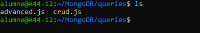<br>

### 3.1	Create (Inserció)<br>
1.	Insereix un nou producte individual amb insertOne()<br>
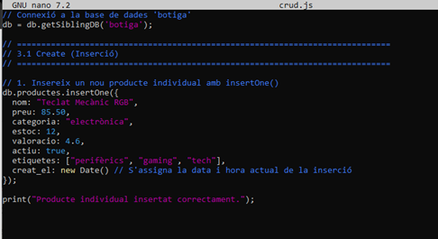<br>
2.	Insereix 3 productes nous de la categoria 'ofertes' amb insertMany()<br>
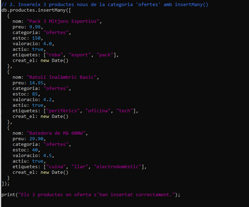<br>

### 3.2	Read (Lectura)<br>
3. Llista tots els productes de la col·lecció mostrant tota la seva informació.<br>
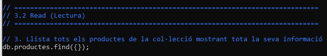<br>
4. Cerca tots els productes amb preu inferior a 50 €. Mostra tota la informació del producte.<br>
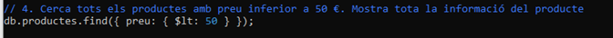<br>
5. Cerca productes d'una categoria específica amb estoc > 0. Mostra tota la informació del producte. <br>
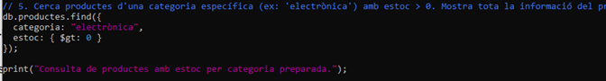<br>
6. Cerca productes amb valoració >= 4.0, mostrant només nom, preu i valoració (projecció) <br>
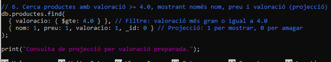<br>
7. Cerca productes per etiqueta<br>
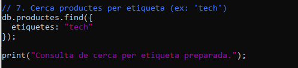<br>

### 3.3 Update (Actualització)<br>
8. Actualitza el preu d'un producte específic amb updateOne()<br>
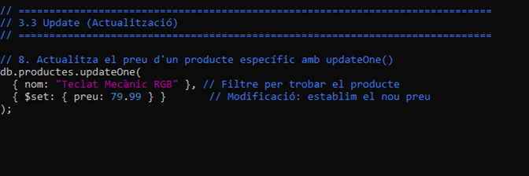<br>
9. Augmenta l'estoc de tots els productes d'una categoria en 10 unitats amb updateMany()<br>
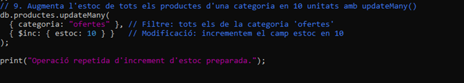<br>
10. Afegeix una nova etiqueta a un producte existent<br>
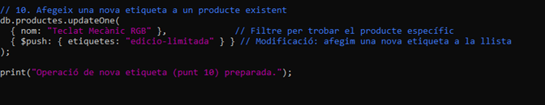<br>
11. Desactiva (actiu: false) tots els productes sense estoc amb updateMany()<br>
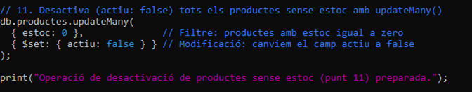<br>

### 3.4 Delete (Eliminació)<br>
12. Elimina un producte pel seu nom.<br>
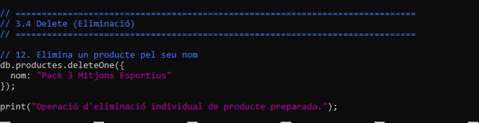<br>
13. Elimina tots els productes de la categoria 'ofertes' que has creat anteriorment<br>
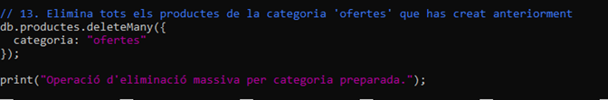<br>

### 3.5 Preguntes teòriques<br>

#### 1.	Tal com has creat la col·lecció de productes, el seu nom és únic? Justifica la resposta.
**No, el nom del producte no és únic** tal com s'ha creat la col·lecció per defecte.

A MongoDB, l'únic camp que té garantida la unicitat de forma automàtica i obligatòria és el camp `_id`. Si inserim dos o més productes amb exactament el mateix nom (per exemple, dos productes anomenats `"Teclat Mecànic RGB"`), MongoDB els acceptarà tots dos sense donar cap error, ja que els assignarà valors d'`_id` (ObjectId) diferents a cadascun.

Perquè el camp `nom` fos únic i evités duplicats, hauríem d'haver creat explícitament un **índex únic** sobre aquest camp mitjançant la instrucció:
`db.productes.createIndex({ nom: 1 }, { unique: true })`

#### 2.	Què significa el terme “projectar” en les consultes? Explica-ho amb un exemple diferent del d’aquest enunciat.

En el context de les bases de dades (tant NoSQL com SQL), **projectar** (o fer una projecció) significa **seleccionar quins camps específics volem que ens retorni una consulta** i quins volem amagar. En lloc de rebre el document sencer amb tota la seva informació (que pot ser molt pesat), filtrem les columnes o propietats per optimitzar l'ús de memòria i xarxa.

A MongoDB, la projecció s'especifica com a segon paràmetre de la funció `.find()`, utilitzant un `1` per indicar els camps que volem veure, i un `0` per als que volem ocultar.

**Exemple:**
Imaginem una col·lecció d'usuaris d'una aplicació anomenada `usuaris`. Cada document conté molta informació: nom, cognoms, contrasenya encriptada, adreça, telèfon, gènere, preferències de la interfície i data de registre. Si només volem fer un llistat públic amb els noms dels usuaris de la plataforma, farem una projecció per estalviar recursos i protegir dades privades:

```javascript
db.usuaris.find(
  { actiu: true },                            // Filtre: només usuaris actius
  { nom: 1, cognoms: 1, _id: 0 }              // Projecció: només volem veure nom i cognom, i amaguem l'ID
)
```

#### 3.	Llista totes les funcions i operadors que hagis utilitzat en les consultes, explica el seu significat i descriu un exemple d’ús diferent dels exemples d’aquest enunciat.

`insertOne()`
* **Significat:** Insereix un únic document dins de la col·lecció especificada. Si el document no inclou el camp `_id`, MongoDB el generarà automàticament.

* **Exemple d'ús:** Inserir un cotxe nou al concessionari.
  ```javascript
  db.vehicles.insertOne({
    marca: "Seat",
    model: "Ibiza",
    any: 2024,
    combustible: "Gasolina",
    preu: 18500
  });

`insertMany()`
* **Significat:** Permet inserir múltiples documents en una col·lecció de manera simultània mitjançant un array d'objectes, optimitzant el rendiment i reduint el nombre de peticions al servidor.

* **Exemple d'ús:** Registrar un lot de motos noves a l'estoc.
```JavaScript
db.vehicles.insertMany([
  { marca: "Yamaha", model: "MT-07", tipus: "Moto", preu: 7999 },
  { marca: "Honda", model: "CB500X", tipus: "Moto", preu: 7200 }
]);
```

`find()`
* **Significat:** Recupera i selecciona documents d'una col·lecció. Accepta un primer paràmetre opcional de filtre per acotar els criteris de cerca i un segon paràmetre de projecció per definir quins camps es volen visualitzar o ocultar.

* **Exemple d'ús:** Cercar tots els vehicles de la marca "Toyota", mostrant només el model i el preu sense reflectir l'identificador intern.
```JavaScript
db.vehicles.find(
  { marca: "Toyota" },
  { model: 1, preu: 1, _id: 0 }
);
```

`updateOne()`
* **Significat:** Modifica el primer document que coincideixi amb el filtre de cerca especificat. S'utilitza de forma directa amb operadors de modificació com $set.

* **Exemple d'ús:** Modificar el preu d'un cotxe específic localitzat mitjançant el seu identificador únic.
```JavaScript
db.vehicles.updateOne(
  { _id: ObjectId("64b1f2c3e4b0c123456789ab") },
  { $set: { preu: 17900 } }
);
```

`updateMany()`
* **Significat:** Modifica de manera massiva tots els documents de la col·lecció que compleixin estrictament amb les condicions aplicadas al filtre.

* **Exemple d'ús:** Aplicar un descompte de 1.000 € a tots els cotxes fabricats abans de l'any 2018.
```JavaScript
db.vehicles.updateMany(
  { any: { $lt: 2018 } },
  { $inc: { preu: -1000 } }
);
```

`deleteOne()`
* **Significat:** Elimina de la col·lecció el primer document que coincideixi amb els criteris de filtratge proporcionats.

* **Exemple d'ús:** Esborrar de l'inventari un vehicle concret identificat per la seva matrícula.
```JavaScript
db.vehicles.deleteOne({ matricula: "1234XYZ" });
```

`deleteMany()`
* **Significat:** Elimina de manera definitiva tots els documents d'una col·lecció que compleixin el criteri o condició descrita al filtre.

* **Exemple d'ús:** Netejar l'historial eliminant tots els vehicles catalogats en l'estat de "desballestament".
```JavaScript
db.vehicles.deleteMany({ estat: "desballestament" });
```

`$gt / $gte`
* **Significat:** Operadors de comparació Greater Than (Major que) i Greater Than or Equal (Major o igual que). S'utilitzen per fer cribratges numèrics o cronològics basats en valors mínims.

* **Exemple d'ús:** Filtrar els vehicles que disposin d'una potència igual o superior als 150 cavalls
```JavaScript
db.vehicles.find({ potencia: { $gte: 150 } });
```

`$lt / $lte`
* **Significat:** Operadors de comparació Less Than (Menor que) i Less Than or Equal (Menor o igual que). S'utilitzen per delimitar cerques basades en valors màxims de referència.

* **Exemple d'ús:** Trobar vehicles d'ocasió que tinguin un quilometratge estrictament menor a 50.000 km.
```JavaScript
db.vehicles.find({ quilometratge: { $lt: 50000 } });
```

`$set`
* **Significat:** Operador d'actualització que assigna un nou valor a un camp concret. Si el camp no existeix en el document original, el crea de manera immediata.

* **Exemple d'ús:** Actualitzar el cicle de vida d'un vehicle canviant el seu estat a "Venut" i afegint de forma dinàmica la data actual de l'operació.
```JavaScript
db.vehicles.updateOne(
  { matricula: "9999AAA" },
  { $set: { estat: "Venut", data_venda: new Date() } }
);
```

`$inc`
* **Significat:** Operador d'actualització dissenyat per incrementar o reduir un camp de tipus numèric en una quantitat especificada de manera relativa.

* **Exemple d'ús:** Incrementar automàticament en 1 any el període de cobertura de garantia de tots els vehicles que estiguin marcats en promoció especial.
```JavaScript
db.vehicles.updateMany(
  { promocio: true },
  { $inc: { anys_garantia: 1 } }
);
```

`$push`
* **Significat:** Operador d'actualització estructurada que afegeix de manera directa un element al final d'un camp que conté un tipus de dada estructurat en forma d'array o llista.

* **Exemple d'ús:** Annexar un nou registre d'inspecció mecànica dins de l'historial de revisions acumulades d'un automòbil.
```JavaScript
db.vehicles.updateOne(
  { matricula: "5555BBB" },
  { $push: { revisions: { data: new Date(), taller: "Oficial", OK: true } } }
);
```


## Bloc 4 – Consultes avançades i índexs<br>
Crea el fitxer queries/advanced.js amb les consultes avançades i la gestió d'índexs.<br>
<br>

### 4.1 Consultes avançades
1. Utilitza $and per cercar productes actius amb preu entre 20 € i 100 €<br>
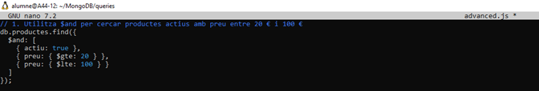<br>
2. Utilitza $or per cercar productes de categoria 'electrònica' o valoració >= 4.5<br>
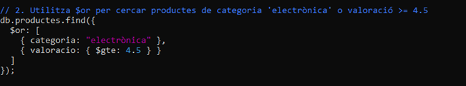<br>
3. Utilitza $regex per cercar productes el nom dels quals contingui una paraula clau<br>
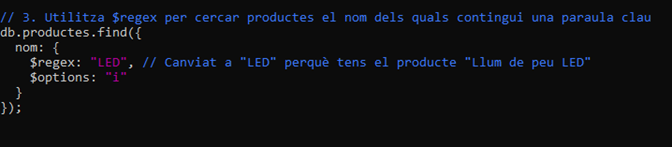<br>
4. Ordena els productes per preu descendent i limita el resultat a 5 (sort + limit)<br>
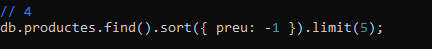<br>
5. Compta quants productes hi ha per categoria ($group de l'agregació)<br>
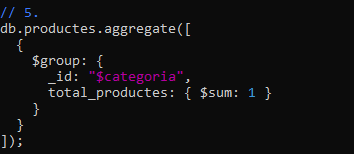<br>
6. Calcula el preu mitjà per categoria amb $group i $avg<br>
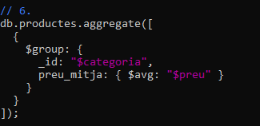<br>
7. Calcula el total de consum per client (quan s’ha gastat cada client).<br>
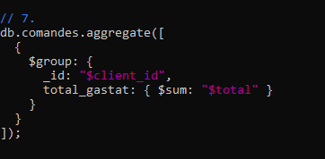<br>

### 4.2 Gestió d'índexs<br>
7. Crea un índex simple al camp categoria<br>
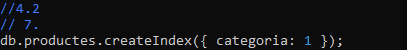<br>
8. Crea un índex compost per (categoria, preu)<br>
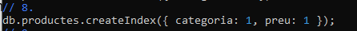<br>
9. Crea un índex de text al camp nom per permetre cerques full-text<br>
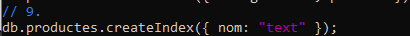<br>
10. Utilitza explain('executionStats') per comparar una consulta sense índex i amb índex.<br>
Documenta la diferència segons el valor nDocs Examined.<br>
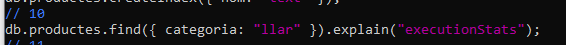<br>
11. Llista tots els índexs de la col·lecció amb getIndexes()<br>
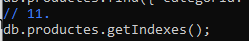<br>

### 4.3 Preguntes teòriques<br>

### 1.	Quan pot ser perjudicial tenir massa índexs en una col·lecció? Explica el compromís (trade-off) entre lectura i escriptura.
Tenir massa índexs perjudica el rendiment general perquè els índexs no són gratuïts: tenen un cost de manteniment en cada modificació de dades.

El **compromís (trade-off)** es defineix així:

* Lectura (Benefici): Quants més índexs tinguis, més ràpides seran les consultes (find), ja que la base de dades troba la informació directament sense haver d'escanejar tota la col·lecció.

* Escriptura (Perjudici): Quants més índexs tinguis, més lentes seran les escriptures (insert, update, delete). Cada vegada que afegeixes o modifiques un document, la base de dades s'ha d'aturar a actualitzar i reordenar tots i cadascun dels índexs un per un.

A més, els índexs consumeixen molta memòria RAM. Si en crees massa i superen la capacitat del servidor, la base de dades començarà a llegir en disc dur i el rendiment general caurà en picat.

### 2.	Llista totes les funcions i operadors que hagis utilitzat en les consultes, explica el seu significat i descriu un exemple d’ús diferent dels exemples d’aquest enunciat.

`$and`
* **Significat:** Operador lògic condicional que requereix el compliment de totes i cadascuna de les expressions incloses dins del seu array per tal de retornar un document.

* **Exemple d'ús:** Cercar automòbils que disposin d'un motor de tipus "Híbrid" i que simultàniament el seu preu comercial se situï per sota dels 25.000 €.
```JavaScript
db.vehicles.find({
  $and: [
    { combustible: "Híbrid" },
    { preu: { $lt: 25000 } }
  ]
});
```

`$or`
* **Significat:** Operador lògic condicional que avalua un conjunt de condicions en format d'array i selecciona els documents que en compleixin com a mínim una.

* **Exemple d'ús:** Buscar vehicles que siguin de color "Vermell" o que alternativament pertanyin a la marca "Ferrari".
```JavaScript
db.vehicles.find({
  $or: [
    { color: "Vermell" },
    { marca: "Ferrari" }
  ]
});
```

`$regex`
* **Significat:** Proporciona capacitats de concordança de patrons mitjançant Expressions Regulars sobre cadenes de text. Permet trobar coincidències parcials d'una paraula o fragment dins d'un camp de text de manera flexible.

* **Exemple d'ús:** Cercar automòbils on el nom del seu model contingui el terme "Sport", configurant l'opció i per ignorar majúscules i minúscules.
```JavaScript
db.vehicles.find({ model: { $regex: "sport", $options: "i" } });
```

`sort()`
* **Significat:** Modifica l'ordre de sortida dels documents retornats per una consulta en base a un o diversos camps determinats. Rep el valor 1 per a un ordenament ascendent i -1 per a un descendent.

* **Exemple d'ús:** Organitzar la llista total de cotxes ordenant-los cronològicament des del model més nou fins al més antic.
```JavaScript
db.vehicles.find().sort({ any: -1 });
```

`limit()`
* **Significat:** Especifica i fixa el nombre màxim de documents que el cursor de la consulta pot retornar a l'usuari.

* **Exemple d'ús:** Llistar exclusivament els 3 vehicles amb el preu de venda més econòmic de tota la col·lecció.

```JavaScript
db.vehicles.find().sort({ preu: 1 }).limit(3);
```

`aggregate()`
* **Significat:** Executa operacions de processament de dades complexes mitjançant seqüències estructurades (etapes o pipelines). Transforma i agrupa documents per extreure valors analítics o resumits.

* **Exemple d'ús:** Iniciar una seqüència estructurada de dades per analitzar mètriques de rendiment o financeres agregades.
```JavaScript
db.vehicles.aggregate([
  { $match: { disponible: true } }
]);
```

`$group`
* **Significat:** Etapa fonamental dins d'una canonada d'agregació (aggregate) que desglossa i consolida els documents entrants en blocs d'informació unificats mitjançant una clau d'expressió definida a l'identificador _id.

* **Exemple d'ús:** Agrupar tota la flota del concessionari segons la tipologia del seu combustible de cara a calcular mètriques subsegüents.
```JavaScript
db.vehicles.aggregate([
  { $group: { _id: "$combustible" } }
]);
```

`$sum`
* **Significat:** Acumulador de l'etapa d'agregació que calcula i computa la suma total dels valors numèrics extrets dels documents d'un mateix grup. Si rep un valor constant de 1, opera de forma equivalent a un comptador d'elements (count).

* **Exemple d'ús:** Comptabilitzar de forma numèrica la quantitat exacta de cotxes de cada marca que estan registrats actualment en el sistema.
```JavaScript
db.vehicles.aggregate([
  { $group: { _id: "$marca", total_unitats: { $sum: 1 } } }
]);
```

`$avg`
* **Significat:** Acumulador específic per a fases d'agregació que avalua un conjunt de valors numèrics i retorna de manera automàtica la mitjana aritmètica dels valors de la mostra processada.

* **Exemple d'ús:** Computar el preu comercial mitjà de la flota de cotxes segmentant la informació final segons el tipus de combustible que utilitzen.
```JavaScript
db.vehicles.aggregate([
  {
    $group: {
      _id: "$combustible",
      total_vehicles: { $sum: 1 },
      preu_mitja: { $avg: "$preu" }
    }
  }
]);
```
`createIndex()`
* **Significat:** Mètode que s'utilitza per crear índexs en una col·lecció. Els índexs milloren dràsticament la velocitat i el rendiment de les operacions de cerca, ja que permeten a MongoDB recórrer les dades estructuradament en lloc de fer una inspecció completa de tota la col·lecció (collscan).

* **Exemple d'ús:** Crear un índex ascendent en el camp "matricula" per agilitzar les cerques d'un vehicle concret a través del seu identificador de circulació, garantint a més que no hi hagi duplicats.
```JavaScript
db.vehicles.createIndex({ matricula: 1 }, { unique: true });
```

`getIndexes()`
* **Significat:** Mètode que retorna una llista amb la descripció detallada de tots els índexs existents dins d'una col·lecció específica, incloent-hi els camps afectats, la seva orientació i les opcions de configuració aplicades.

* **Exemple d'ús:** Sol·licitar l'historial complet d'índexs actius en la col·lecció de vehicles per verificar si les optimitzacions de rendiment s'han aplicat correctament.
```JavaScript
db.vehicles.getIndexes();
```